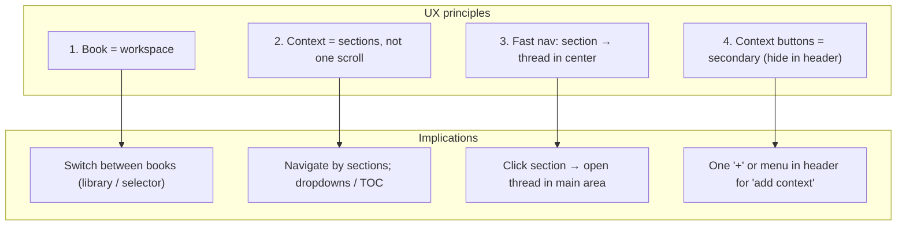
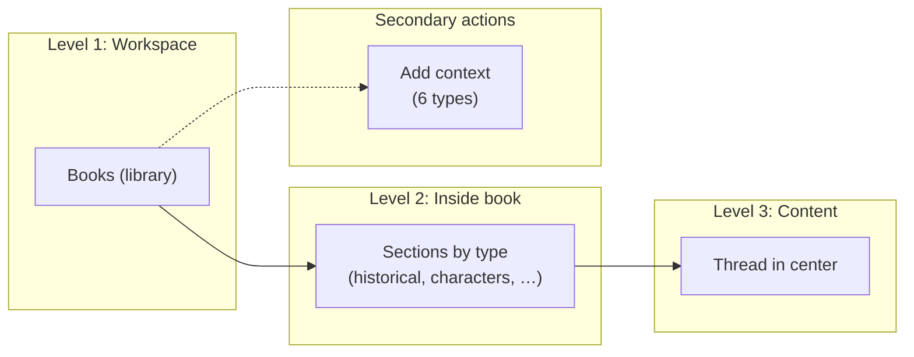
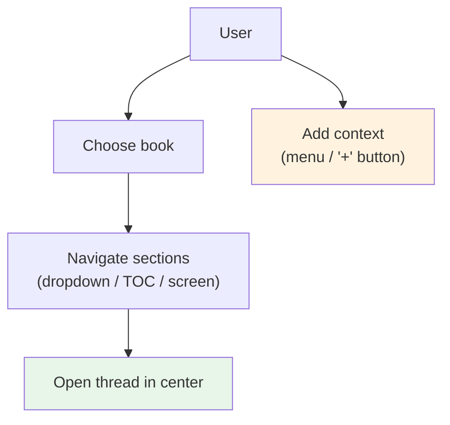
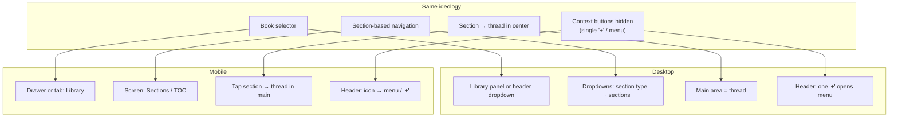

# SageRead — UX ideology

High-level direction for navigation, content structure, and layout (desktop and mobile). See [UI-LAYOUT.md](UI-LAYOUT.md) for DOM and scroll rules.

---

## 1. Principles (overview)

---

## 2. Information architecture

---

## 3. Navigation flow (conceptual)

---

## 3.1. Initial workspace affordances

- On the very first screen (before book recognition), the header already shows the 6 context types and Chat as disabled controls.
- This makes the workspace structure (sections + chat channel) visible from the start, even though context generation and chat become available only after the book is recognized and the journey begins.

## 4. Desktop vs mobile (same ideology)

---

*Reference: product direction (multiple books, sections, fast nav, collapsed context buttons). Mobile approach: [discussion in chat]; implementation: to be described in branch plan or UI-LAYOUT.*
