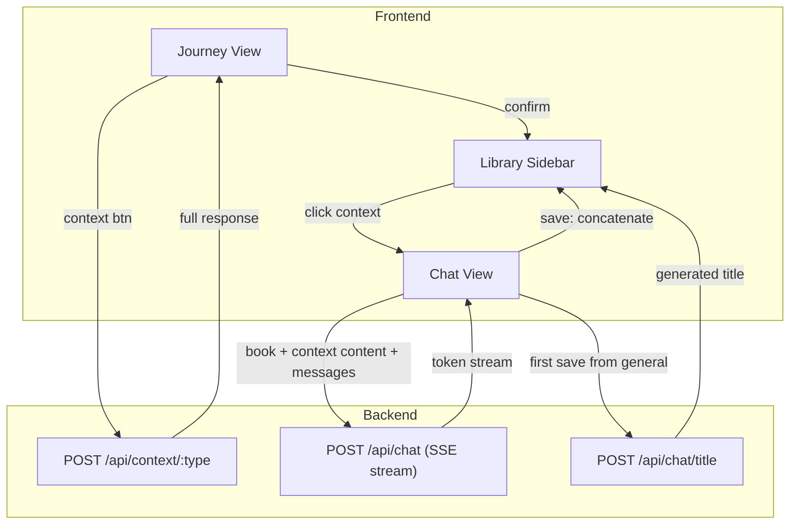

# Чат-фича: архитектурный план (v2)

> Branch: `feat/chat`
> Created: 2026-02-18

## Ключевые решения (утверждены)

- **Модель данных**: плоский массив `pinnedBook.contexts[]`, без вложенности (parent/children). Сохранение из чата конкатенирует контент к существующей записи.
- **Чат в main area**: заменяет текущий journey content.
- **Стриминг**: SSE от бэкенда, токены появляются по мере генерации.
- **Per-topic threads**: каждый pinned context имеет свой чат-тред; плюс общий чат о книге.
- **Вход в чат**: клик по context в sidebar (показывает сохранённый контент как первое сообщение) или кнопка Chat в header (общий чат).
- **Save to context**: кнопка на каждом AI-ответе. Из контекстного чата -- конкатенация к родительскому context. Из общего чата -- создание нового top-level pinned context.
- **System prompt**: книга + контент текущего контекста + история чата. Кросс-контекстная осведомлённость ("Other known contexts") -- на будущее, не в этой итерации.

---

## Модель данных

### pinnedBook.contexts -- плоский массив с конкатенацией

```js
// Было (объект с фиксированными ключами):
contexts: { historical: "текст...", cultural: "текст..." }

// Станет (массив, единая структура):
contexts: [
  { id: "ctx-1", type: "historical", title: "Historical Context",
    content: "Булгаков писал роман в 1930-е... [---] Образ Воланда формировался под влиянием..." },
    //                                         ↑ конкатенация: исходный контент + сохранённое из чата
  { id: "ctx-2", type: "cultural", title: "Cultural Context",
    content: "Роман стал одним из..." },
  { id: "ctx-3", type: "chat", title: "Символика числа 3",   // из общего чата
    content: "В романе число 3 появляется... [---] В библейских главах число 3..." }
]
```

**Правила конкатенации:**

- При "Save to context" из контекстного чата (тред привязан к ctx-1): `ctx-1.content += "\n\n---\n\n" + newContent`
- При первом "Save to context" из общего чата: создаётся новый `{ id, type: "chat", title: AI-generated, content }`, тред привязывается к нему
- При последующих "Save to context" из того же общего треда: конкатенация к привязанному context

### chatThreads -- per-topic история чата

```js
chatThreads = {
  "ctx-1": {                    // тред привязан к Historical Context
    messages: [
      { id: "m1", role: "assistant", content: "Булгаков писал...", fromContext: true },
      { id: "m2", role: "user", content: "А что с Воландом?" },
      { id: "m3", role: "assistant", content: "Образ Воланда формировался...", saved: true }
    ]
  },
  "general": {                  // общий чат (до первого сохранения)
    boundToContextId: null,     // станет "ctx-3" после первого Save
    messages: [...]
  }
}
activeChatThreadId: "ctx-1" | "general" | null
```

---

## Поток данных



---

## Изменения по слоям

### 1. Backend (sage-read-backend/server.js)

#### `POST /api/chat` -- SSE streaming (новый)

Основной endpoint чата. Принимает контекст книги и историю сообщений, стримит ответ AI по токенам.

**Request:**

```json
{
  "title": "Мастер и Маргарита",
  "author": "Михаил Булгаков",
  "meta": "Роман · 1967 · СССР",
  "language": "Russian",
  "contextContent": "Булгаков писал роман в 1930-е...",
  "messages": [
    { "role": "assistant", "content": "Булгаков писал роман в 1930-е..." },
    { "role": "user", "content": "А что с Воландом?" }
  ]
}
```

- `contextContent` (опционально) -- текст текущего pinned context (уже сконкатенированный). Передаётся только для контекстных чатов (тред привязан к конкретному context). Для общего чата -- `null` или не передаётся.
- `messages` -- полная история треда в формате OpenAI (role + content). Фронтенд отправляет все сообщения, бэкенд не хранит состояние.

**System prompt (формируется на бэкенде):**

```
You are SageRead, a reading companion discussing "{title}" by {author}.
{meta}

{если contextContent:}
The following context has been established about this book:
{contextContent}

Continue the conversation based on this context. Be conversational, insightful,
and stay focused on the topic.

IMPORTANT: Respond in {language}.
```

**Response:** SSE stream (Content-Type: text/event-stream)

```
data: {"token":"Образ"}

data: {"token":" Воланда"}

data: {"token":" формировался"}

...

data: [DONE]
```

Каждый `data:` -- отдельный JSON с полем `token` (один или несколько токенов текста). Финальное событие `[DONE]` сигнализирует завершение стрима.

**Ошибки:**

- `400` -- отсутствует title/author или пустой messages
- `500` -- ошибка DeepSeek API (стрим закрывается с `data: {"error":"..."}`)

---

#### `POST /api/chat/title` -- генерация заголовка (новый)

Генерирует короткий заголовок (3-5 слов) для сохраняемого ответа из чата. Используется при первом "Save to context" из общего чата для создания нового pinned context.

**Request:**

```json
{
  "content": "Образ Воланда формировался под влиянием нескольких ключевых процессов 1930-х годов...",
  "language": "Russian"
}
```

**Response:**

```json
{
  "ok": true,
  "title": "Влияние 1930-х на образ Воланда"
}
```

**System prompt:**

```
Generate a concise title (3-5 words) for the following text.
The title should capture the main topic discussed.
Return ONLY the title text, no quotes, no explanation.
IMPORTANT: Write the title in {language}.
```

**Ошибки:**

- `400` -- отсутствует content
- `500` -- ошибка DeepSeek API

---

#### Существующие endpoints -- без изменений

- `GET /api/health` -- health check
- `POST /api/analyze` -- распознавание книги
- `POST /api/context/:type` -- 6 типов контекста (historical, cultural, characters, references, quotes, lesson)

### 2. Frontend State (sage-read-app/src/App.js)

**Рефакторинг `pinnedBook.contexts`:** объект -> массив. Затрагивает:

- `confirmContext()`: вместо spread по ключу -- push в массив
- Sidebar рендеринг: вместо 6 условных блоков -- `.map()` по массиву
- Header кнопки: без изменений (кнопки остаются, только confirmContext меняется)

**Новое состояние (рекомендуется `useReducer`):**

- `chatThreads` -- объект тредов по contextId
- `activeChatThreadId` -- какой тред сейчас активен (null = нет чата)
- `chatStreaming` -- идёт ли стрим
- `streamingContent` -- текущий накопленный текст стрима

### 3. Frontend UI

**Новый компонент `Chat`:**

```
.chat-container
  .chat-messages                 (scrollable, auto-scroll вниз)
    .chat-message--assistant     (первое сообщение = saved context если из sidebar)
    .chat-message--user
    .chat-message--assistant
      .message-content
      [Save to context]          (на каждом завершённом AI-ответе)
    .chat-message--streaming     (анимированный курсор во время стрима)
  .chat-input-bar                (sticky footer)
    textarea + send button
```

**Точки входа:**

- Header: кнопка Chat (общий чат, `activeChatThreadId = "general"`)
- Sidebar: клик по pinned context (context content как первое сообщение, `activeChatThreadId = ctxId`)
- Переключение назад: кнопка в header или клик по context button (возврат в Journey view)

**Sidebar:** рендеринг через `.map()`, тип "chat" визуально отличается от системных (иконка, стиль заголовка).

### 4. CSS (sage-read-app/src/App.css)

- Стили чата: `.chat-container`, `.chat-message--*`, `.chat-input-bar`
- Стриминг: анимация курсора (мигающий блок)
- Кнопка save-to-context на AI-сообщениях
- Адаптация layout: chat view использует тот же `main--journey` (top-aligned)
- ~100-150 строк нового CSS

### 5. Документация

- docs/UI-LAYOUT.md: секция про chat layout, scroll behavior, entry points
- docs/API.md: endpoints `/api/chat` (SSE), `/api/chat/title`

---

## Git-стратегия

**Ветка:** `feat/chat` от master. Все 4 фазы -- серия коммитов в одной ветке.

**Теги-чекпоинты:** после завершения каждой фазы:

- `git tag phase-1-done` -- рефакторинг contexts
- `git tag phase-2-done` -- backend streaming
- `git tag phase-3-done` -- chat UI
- `git tag phase-4-done` -- save to context

**Отладка:** `git diff phase-N-done..HEAD`, `git checkout phase-N-done`, `git bisect`.

**Финал:** `git checkout master && git merge feat/chat`.

---

## Порядок реализации (4 фазы)

### Phase 1: Рефакторинг модели contexts

Переход `pinnedBook.contexts` с объекта на массив `[{id, type, title, content}]`. Ломающее изменение внутренней структуры, без нового UI. Sidebar рендерит через `.map()`, `confirmContext()` делает push. Все 6 системных контекстов работают как раньше.

Файлы: `App.js` (state, confirmContext, sidebar render), `App.css` (минимально).

### Phase 2: Backend streaming + title endpoints

Добавить `POST /api/chat` с SSE и `POST /api/chat/title`. Независимо от фронтенда, тестируется через curl. System prompt: книга + contextContent + messages. Без кросс-контекстной осведомлённости.

Файлы: `server.js`, `docs/API.md`.

### Phase 3: Chat UI + per-topic threads

Компонент Chat в main area. `chatThreads` map + `activeChatThreadId`. Вход из sidebar (context content = первое сообщение) и из header (общий чат). Стриминг. Переключение между Journey и Chat.

Файлы: `App.js` (Chat компонент, state, routing), `App.css` (стили чата).

### Phase 4: Save to context + конкатенация

Кнопка "Save to context" на AI-ответах. Контекстный чат: конкатенация к content родительского context. Общий чат: первый save -> `POST /api/chat/title` -> новый top-level context, тред привязывается; последующие save -> конкатенация. Обновление sidebar в реальном времени.

Файлы: `App.js` (save logic, sidebar update), `docs/UI-LAYOUT.md`.
